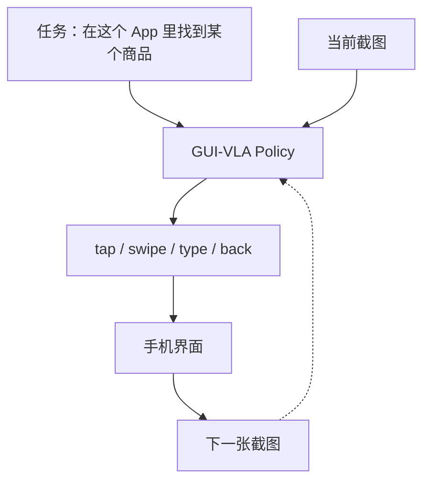
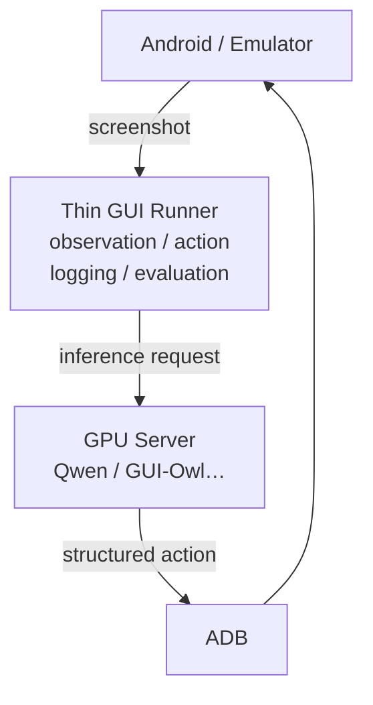
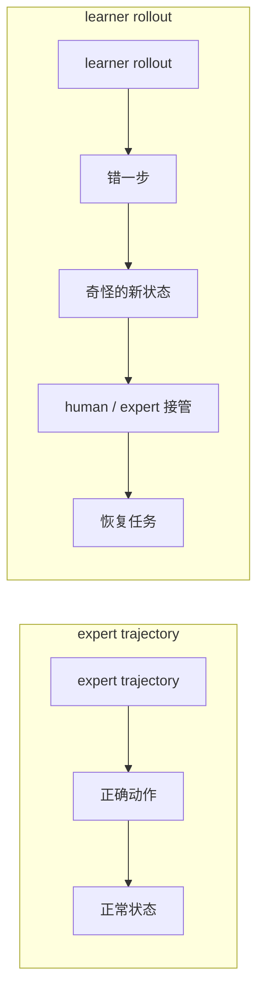
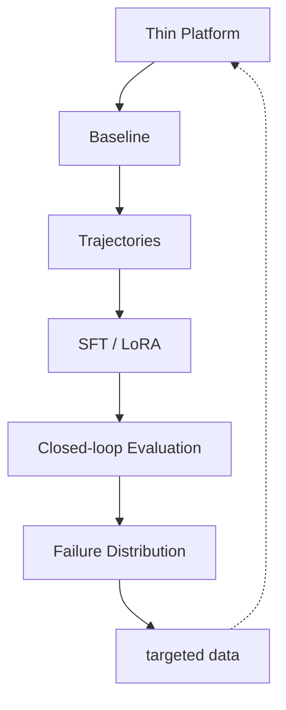
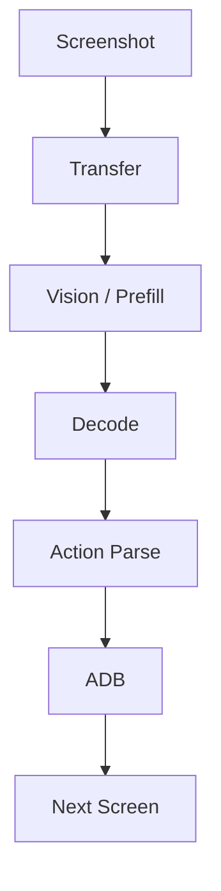
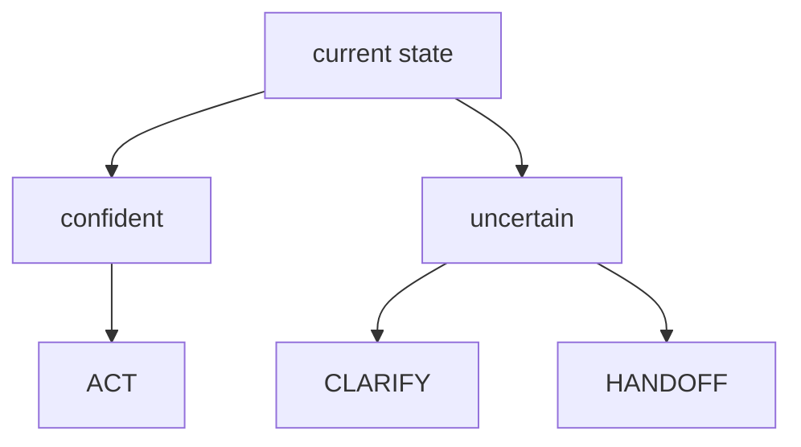

我们接下来一个月要做的事情，可以说得很复杂：云手机、GUI Agent、VLM、VLA、ADB、trajectory、SFT、recovery、latency、uncertainty……

但如果把这些词都拿掉，真正的问题其实很简单：

**给模型一个手机任务和它当前看到的屏幕，它能不能决定下一步应该做什么？**

例如：

如果这个循环能够稳定运行，那么我们研究的就是一个真正运行在环境里的 **action policy**。

这也是整个项目最重要的切分。

---

## 1. 初步 Scope：一个足够薄的闭环

GUI Agent 很容易扩张成一套由 Planner、Executor、Memory、Reflection、Tool Router 和 Critic 组成的复杂 agent stack。

第一阶段先把这些模块放到 scope 外，集中回答一个更窄的问题：任务没完成，究竟是视觉 grounding 不行、动作决策不行，还是历史状态丢了？

$$
\pi_\theta(g,o_{\le t},a_{<t})\rightarrow a_t
$$

这里的 $g$ 是任务，$o_t$ 是手机当前画面，$a_t$ 是下一步 GUI action。

我们先研究：

> **如何把一个已经具备视觉、语言和 GUI 理解能力的模型，变成在目标手机环境里真正好用的 action policy。**

现有模型已经具备输出手机动作的能力。[Qwen3-VL](https://github.com/QwenLM/Qwen3-VL/blob/main/cookbooks/utils/agent_function_call.py) 已经公开提供了面向移动设备的 `mobile_use` 接口，动作中直接包含点击、输入、滑动、等待等手机操作；[GUI-Owl-1.5](https://arxiv.org/abs/2602.16855) 也已经提供 2B、4B、8B 等多个尺寸的原生 GUI 模型。

因此实验问题是：

**到了我们的环境、我们的任务分布、我们的时延约束以后，它到底哪里会坏？我们能不能通过数据和后训练把它修好？**

第一阶段先把闭环实验平台搭起来。项目首先需要一套很薄的实验装置。

我们目前有 headless GPU server，也会接 emulator 和真实 Android 设备。它们最终只需要形成这样一个结构：

第一阶段的平台只做三件事情：

**让模型看到环境，让动作真的发生，让发生过的事情能够被完整记录。**

[AndroidWorld](https://arxiv.org/abs/2405.14573) 是一个很好的参照。它把任务做成了可以反复初始化、执行、检查成功并恢复环境的闭环，因此同一个策略可以被稳定地重复测试。其公开 benchmark 包含 116 个程序化任务、20 个 Android App，并通过动态参数化产生大量任务变化。

我们希望自己的实验平台也拥有这个基本性质：

> **一次运行应当产生一条可以复现、比较和学习的实验轨迹。**

---

## 2. Trajectory 与失败驱动的数据闭环

闭环一旦跑起来，就会自然产生 trajectory。

最简单的一条轨迹从 instruction 开始，交替记录 screenshot 和 action，最后以 success 或 failure 结束。

这里有一个很容易被低估的地方。

我们一开始可能觉得训练数据就是简单的“截图 → 正确动作”。

真实 closed-loop policy 还会进入大量由错误动作产生的新状态：

模型部署以后，一个更棘手的问题是：

> **我刚才已经点错了，现在怎么办？**

所以我们从第一天就准备保留完整的 `screen_t → action_t → screen_t+1`，孤立的 screenshot/action pair 无法覆盖这些恢复状态。

[OpenMobile](https://arxiv.org/abs/2604.15093) 在 2026 年公开的 mobile-agent 数据工作里采用了 learner/expert policy switching：让 learner 自己 rollout，在出错状态由 expert 接管，从而专门捕获普通 imitation learning 很容易缺失的 error-recovery data。它们在 AndroidWorld 上对 Qwen3-VL 的后训练也说明，trajectory 的组成方式本身就是一个重要实验变量。

所以在我们的项目里，**数据既是训练原料，也是研究对象。**

这些 trajectory 随后进入失败驱动的数据闭环。把前面的部分连起来以后，一个月的主路线其实只有这一张图：

这张图可能比四周计划本身更重要。

它规定了一种项目节奏：先让 baseline 在真实任务里跑，再根据失败分布决定数据和训练方向。

如果大量失败来自 grounding，就针对 grounding 采数据；如果模型经常走到错误页面以后无法回来，就研究 recovery；如果主要问题是 long-horizon state，就再研究 history representation；如果 8B 已经够准但太慢，再认真研究 4B、视觉 token 和 serving。

算法方向由 failure distribution 拉出来。

---

## 3. 闭环评估：成功率、时延与停止行动

评估至少包含三个维度：task success、**latency**，以及模型何时停止自动执行。

一个模型即使最终能够完成任务，如果每点击一次都要思考十秒，它也很难成为一个真正可交互的手机 policy。

因此我们会从最早的 baseline 就测：

以后讨论 4B 和 8B，需要进一步判断：

> **多出来的能力，值不值得多出来的视觉计算和 action latency？**

另一个维度是 **什么时候应该停止行动**。遇到信息不足、陌生 UI 或高风险操作时，合理的输出可能是：

第一周先在 action space 中保留这种表达，复杂的 uncertainty 方法可以放到后续实验：

**“我现在不应该继续自动执行。”**

---

## 4. 四周计划：先闭合实验链，再决定后续训练

从日历上看，这是一个四周项目。

从研究过程看，它更像四次连续收缩。

|阶段|我们真正要回答的问题|
|---|---|
|**Week 1 · Bootstrap**|这套 Mobile GUI-VLA 实验链到底能不能完整跑起来？|
|**Week 2 · Scaling**|数据和普通 SFT 到底能把 baseline 推多远？|
|**Week 3 · Bottleneck**|剩下的失败主要是哪一两类？|
|**Week 4 · Convergence**|针对这些瓶颈做过的修改，能不能稳定复现并通过隐藏评测？|

第一周最关键的 milestone 是第一次让 Android、Screenshot、GUI-VLA、Action、Trajectory、SFT、New Checkpoint 和 Evaluation 完整串起来。

一旦这条链成立，我们之后提出的很多问题才真正成为“可实验的问题”。

第一阶段的训练路线从 SFT 开始。强化学习是 GUI agent 后续很自然的方向。

近期工作已经开始把目标 App 探索、可执行任务生成、rollout 评估、分层反馈和后续 policy optimization 连在一起。例如 [MobileForge](https://arxiv.org/abs/2606.19930) 就沿着这条路线构建 annotation-free adaptation。

RL 依赖可靠的 environment、rollout、reward/evaluator 和数据管线，而这些正是第一阶段要搭建的部分。在这些条件成熟之前直接进入 RL，会让失败来源难以诊断：reward、环境、trajectory、action parser 和训练算法都可能成为变量。

具体来说，先用 target-domain trajectory 对 pretrained GUI/VLM 做 SFT，再进入 closed-loop evaluation。

等这条链出现 plateau，再评估 RL 是否进入关键路径。

---

## 5. 希望这个项目留下什么

一个月以后，目标是一版成功率高、速度也足够快的 Mobile GUI-VLA，以及一组由实验回答的问题：

- 一张 screenshot 进入 VLM 后，视觉 token 到底给 latency 带来多少成本？
- GUI action representation 到底只是输出格式，还是 policy action space 本身的一部分？
- trajectory 里什么信息后来真的用上了？
- 500 条、1000 条、2000 条数据带来的提升是什么形状？
- 为什么模型在 expert demonstration 上训练得很好，自己一 rollout 却会迅速跑进没见过的状态？
- 4B 和 8B 的真正差异在哪里？
- 历史信息什么时候有帮助，什么时候只是在浪费 context？
- 模型什么时候应该继续执行，什么时候应该停下来问人？

真正跑过实验以后，其中一些答案会比“我们用了某某模型”更有价值。

目前的计划可以压缩成一句话：

> **建立一个足够薄的 Mobile GUI-VLA 闭环，让模型的真实失败持续变成新的训练数据，再用闭环实验决定下一步究竟值得研究什么。**

这个月要建设的是一台反复执行 Observe、Act、Record、Learn、Evaluate 和 Understand why 的实验机器。

第一周，我们先让它转起来。
