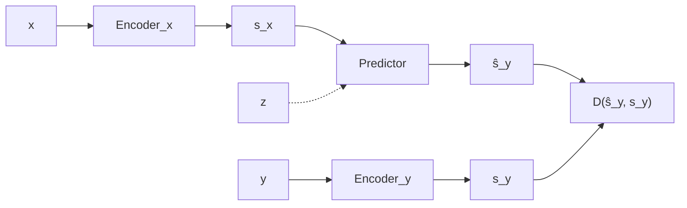
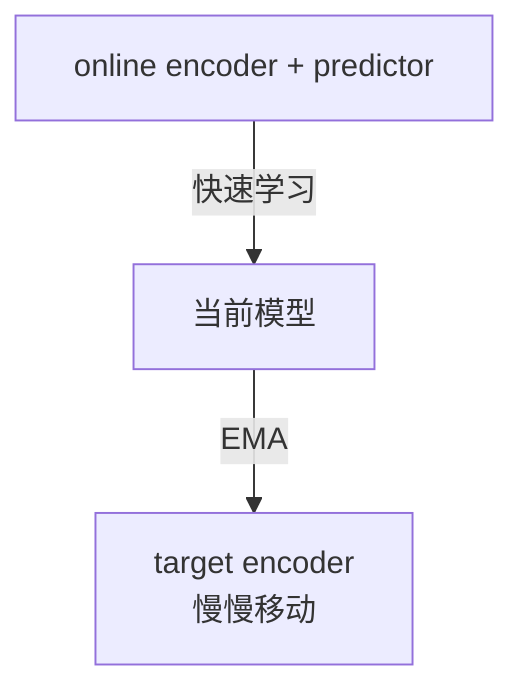
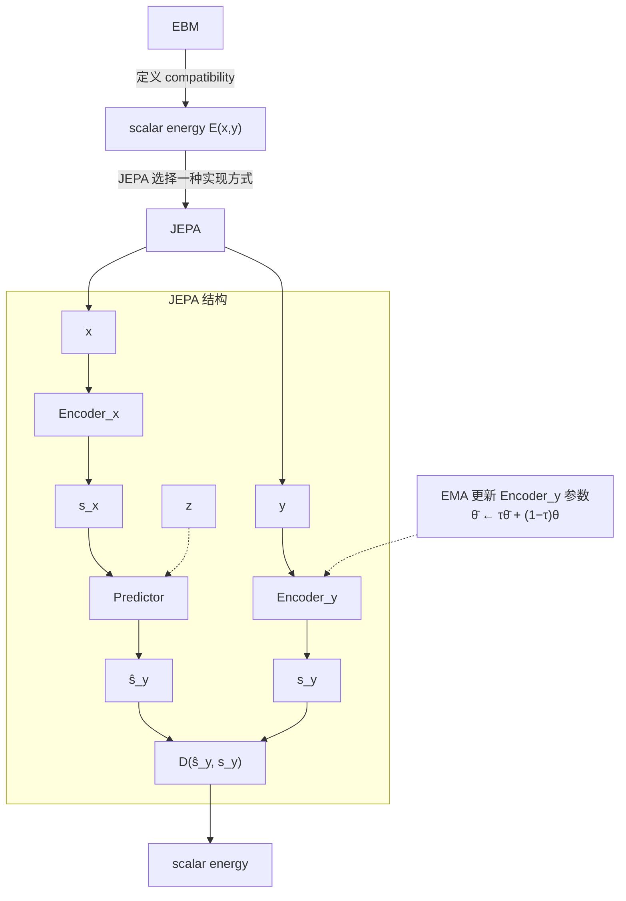

## 1. EBM

普通回归是通过输入拟合输出：
$$
x \rightarrow \hat y  
$$
然后输出逼近真值：
$$
L(\hat y,y).  
$$
EBM 的思路更一般。它定义：
$$
F_w(x,y)\in\mathbb R  
$$
表示：
> $x$ 和 $y$ 这个组合有多“不兼容”。

通常：
$$
F_w(x,y)\text{ 小}  
$$
代表兼容，
$$
F_w(x,y)\text{ 大}  
$$

代表不兼容。
给定 $x$，预测 $y$ 可以写成：
$$
\hat y
=
\arg\min_y F_w(x,y).  
$$

所以模型不一定要直接输出：
$$
\hat y=f(x).  
$$

也可以：

> “给定候选 $y$，告诉你它跟 $x$ 搭不搭。”

这就是 energy-based inference。LeCun 的 2006 tutorial 还特别强调，EBM 不要求像标准概率模型那样把整个分布正规化，因此可以绕开 partition function 的一些困难。([Yann LeCun](https://yann.lecun.com/exdb/publis/ "[bib2web] Yann LeCun's Publications"))

---

## 2. JEPA 通用结构 ([2022 AMI Proposal](https://openreview.net/pdf?id=BZ5a1r-kVsf))




将两个输入：
$$
x,\quad y  
$$
先分别编码：
$$
s_x=\operatorname{Enc}_x(x)  
$$
$$
s_y=\operatorname{Enc}_y(y).  
$$
然后 predictor 试着根据 $s_x$ 和一个可选 latent variable $z$ 产生 $s_y$ 的预测：
$$
\hat s_y = \operatorname{Pred}(s_x,z)  
$$
最后 energy 就可以直接定义为：
$$
\boxed{  
E_w(x,y,z) = D  
\left(  
s_y,  
\operatorname{Pred}(s_x,z)  
\right)  
}  
$$

也就是说：

> **两个东西在 representation space 越容易互相解释，energy 越低。**

也就是 JEPA 可以看成 EBM 的一种具体结构化实现。([arXiv](https://arxiv.org/abs/2306.02572 "Introduction to Latent Variable Energy-Based Models: A Path Towards Autonomous Machine Intelligence"))

这正是 2022 年 autonomous-machine-intelligence proposal 里的通用 JEPA 定义。两个 encoder 甚至**不要求同结构、不要求共享参数**；$x$ 和 $y$ 还可以是不同模态。([2022 AMI Proposal](https://openreview.net/forum?id=BZ5a1r-kVsf))

接着来初步看这些量之间的关系。已经有两个编码器（joint-embedding）了，那这俩怎么接上的？这就要求两个表征要匹配上，建立两个 representation 的 compatibility。
原始 JEPA 要求的是：
$$
\operatorname{Pred}(s_x,z)  
\approx  
s_y.  
$$
$x$ 和 $y$ 完全可以不一样。
例如：
$$
x=\text{现在的视频}  
$$
$$
y=\text{两秒后的世界}.  
$$
那么显然：
$$
s_x\neq s_y  
$$
很正常。
真正希望的是：
$$
s_x  
\overset{\text{predictor}}{\longrightarrow}  
s_y.  
$$
也就是通过 predictor 实现这个表征的变换。

<span id="jepa-representation-s"></span>

> [!NOTE] 关于表征 $s$
> 这到底有什么要求，是否要求 $s$ 本身内部包含一些带信息回路的量？比如包含系统输入输出，也就是含有反馈/[闭环](/writing/find-some-sense/#闭环是什么)？

---
## 3. s, z 和 predictor

predictor 网络用来表示一个比较通用的函数：
$$
P_w(s_x,z).  
$$
也就是：
> **给定对 $x$ 的表示 $s_x$，再补充必要的 latent information $z$，预测与 $y$ 对应的表示。**

例如 $x$ 是现在、$y$ 是未来，那么 predictor 可以扮演 dynamics：
$$
(s_t,z)\rightarrow \hat s_{t+1}.  
$$
如果还加入 action：
$$
(s_t,a_t,z)  
\rightarrow  
\hat s_{t+1},  
$$
它就已经非常接近我们熟悉的 latent world model。
需要根据具体问题选取好 $x,y$ 之间的关系，另外要补充好 $z$。
### 3.1 $z$ 的作用：进一步塑形 latent space

2022 proposal 里的 $z$ 是一个**latent variable，用来表示 $y$ 中存在、但 $x$ 无法确定的信息**。([Meta AI 精简版](https://ai.meta.com/blog/yann-lecun-advances-in-ai-research "Yann LeCun on a vision to make AI systems learn and reason like animals and humans")) 当然 $z$ 也可以是一些显式的变量了。也算是加约束的方法。
例如：
```text
现在：
一个人站在路口

未来可能：
├─ 向左走
├─ 向右走
└─ 原地不动
```

只知道现在：
$$
x  
$$
并不能唯一确定未来：
$$
y.  
$$
如果 predictor 是 deterministic：
$$
s_x\rightarrow\hat s_y,  
$$
它可能不得不预测一个“平均未来”。
于是引入：
$$
z.  
$$
不同的 $z$：
$$
z_1,z_2,z_3  
$$
可以产生不同预测：
$$
\hat s_y^{(1)},  
\hat s_y^{(2)},  
\hat s_y^{(3)}.  
$$
原始 JEPA 的 energy 因此是：
$$
E(x,y,z) = D(s_y,P(s_x,z)).  
$$
可以对 $z$ 做优化，来提取好一点的 $z$ 让 $x,y$ 更加匹配：
$$
F(x,y) = \min_z E(x,y,z).  
$$
意思是：
> 只要**存在某个 latent explanation $z$**，能让 $x$ 很好解释 $y$，那么 $x,y$ 就是 compatible 的。([2022 AMI Proposal](https://openreview.net/forum?id=BZ5a1r-kVsf))

这个设计跟“输出一个 Gaussian variance”完全不是同一种 uncertainty representation。
### 3.2 $s_x,\;s_y$：压缩的信息

> JEPA 为什么不直接预测 $y$？

假设：

$$
x=\text{当前视频}  
$$
$$
y=\text{下一秒视频}.  
$$
如果要求模型预测每个 pixel：
$$
x\rightarrow\hat y,  
$$
模型就必须预测：
- 树叶具体怎么抖；
- 光照微小变化；
- 纹理；
- 背景噪声；
- 每个无法确定的小细节。
但这些东西对行动未必重要。

JEPA 希望：
$$
y\rightarrow s_y  
$$
这个 encoder 主动忽略某些不可预测、无关细节。
于是 predictor 只预测：
$$
\hat s_y.  
$$
JEPA 的主要优势是**在 representation space 预测，因此不必预测 $y$ 的每一个细节**；多模态性一部分可以靠 encoder 丢弃无关不可预测信息，一部分可以由 latent $z$ 表示。([2022 AMI Proposal](https://openreview.net/forum?id=BZ5a1r-kVsf))

> 那么什么样的 $s_x,s_y$ 是好的？

它希望 representation 同时满足两个方向。
一方面：
$$
s_x,\;s_y
$$
要包含**足够多关于输入的信息**，不然两者直接常量相等直接不干了。

另一方面，又希望 representation **不要保存那些无法预测的无关细节**。
所以存在一个张力：
$$
\boxed{\text{informative}}  
$$

vs.

$$
\boxed{\text{predictable}}.  
$$

训练目标的几项概念化约束：
- 最大化 $s_x$ 关于 $x$ 的信息；
- 最大化 $s_y$ 关于 $y$ 的信息；
- 减小 representation prediction error；
- 限制 latent variable $z$ 的信息容量，不要淹没掉 $s_x$ 。
这样的训练目标也是会带来一些训练挑战（[arXiv](https://arxiv.org/abs/2306.02572 "Introduction to Latent Variable Energy-Based Models: A Path Towards Autonomous Machine Intelligence")）。

---
## 4. I-JEPA 中的 EMA
在 I-JEPA 这个具体实现里，通用 JEPA 中的 conditioning information $z$ 不再表现为自由采样的不确定性变量，而是具体对应于目标位置的 mask/position tokens。predictor 接收 context representation，并由这些 tokens 告诉它要预测哪里。

EMA 是后来像 I-JEPA 这种具体 self-supervised realization 采用的 target-network strategy。在这个自监督框架里，可以把 target encoder 看成 teacher-style target network，把 online/context encoder 看成 student。([I-JEPA](https://arxiv.org/pdf/2301.08243))
假设 online/context encoder 参数是：
$$
\theta_t.  
$$
target encoder 参数：
$$
\bar\theta_t.  
$$
不要用 gradient 直接更新 target encoder，而是：
$$
\boxed{  
\bar\theta_t = \tau\bar\theta_{t-1}  
+  
(1-\tau)\theta_t  
}  
$$
其中：
$$
\tau\approx1.  
$$
I-JEPA 具体从 $\tau=0.996$ 开始，并在预训练过程中线性增加到 $1.0$：
$$
\tau:\ 0.996 \longrightarrow 1.0.  
$$
那么 target encoder 就像 online encoder 的**低通滤波/慢速版本**。

为了让变化更容易看出来，下面单独取 $\tau=0.9$ 做一个示意。如果 online 参数变化：
```text
step 1: θ = 1.0
step 2: θ = 1.8
step 3: θ = 1.3
step 4: θ = 2.0
```

EMA target 不会跟着剧烈跳：
```text
θ̄:
1.0 → 1.08 → 1.10 → 1.19 ...
```
所以 target 表示变化更慢。

也就是 EMA 人为制造一个**时间尺度不对称**，让每一步训练时，online side 面对的是一个相对稳定的 target：


这种“online network + slow-moving target network”的 self-supervised 训练方式在 BYOL 中已经非常明确([arXiv](https://arxiv.org/abs/2006.07733 "Bootstrap your own latent: A new approach to self-supervised Learning"))；I-JEPA 后来也采用 EMA target encoder。
这里的 EMA 一方面避免 student 的剧烈变化直接泄露到 teacher，给 predictor 提供相对稳定的目标；另一方面，它和 stop-gradient、online/target 非对称以及 predictor 共同构成 I-JEPA、BYOL 这类方法的 anti-collapse 结构。EMA 本身并不是单独保证不 collapse 的数学条件。后续方法还会加入 variance/covariance regularization 等更显式的约束。

---

## 5. 当前小结




就本文讨论的训练目标而言，和 Dreamer 比起来，Dreamer 更加侧重显式的状态转移预测，JEPA 更加侧重 latent space 中哪些信息值得保留与预测。
